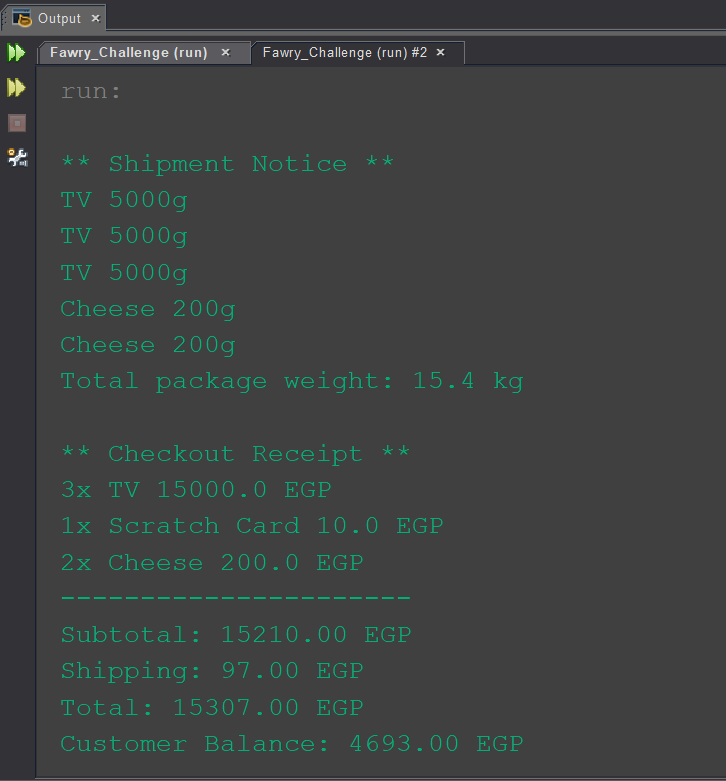

# E-commerce System

A simple Java-based E-commerce system built for the **Fawry Rise Journey** Full Stack Development Internship Challenge.

## Features

- Manage a list of products with:
  - Name
  - Price
  - Quantity
  - Expiration date (optional)
  - Shipping requirement (optional)
  - Weight (for shippable items)

- Add products to cart with specified quantity (cannot exceed available stock).
- Display available products in a formatted table.
- Checkout with:
  - Order subtotal calculation
  - Shipping fee calculation (based on weight)
  - Total amount (subtotal + shipping)
  - Customer balance update after payment

- Shipping service simulation:
  - All shippable items are collected and passed to a shipping service that prints shipment details (weight and product names).

## Usage

Run to:

1. Display available products.
2. Add products to the cart.
3. Display cart contents.
4. Perform checkout with receipt and shipping details.
5. Handle invalid scenarios such as:
   - Empty cart
   - Insufficient balance
   - Expired products
   - Exceeding available stock

## Code Highlights

- Products are modeled using the `Product` class implementing the `ShippableItems` interface.
- Shipping is handled by the `ShippingService` class.
- The system tracks customer balance and updates it after each checkout.

## Output
Click the image below to watch a short demo video showing how the system works step by step:

  

